# Architecture Diagram Pack — Multi-Tenant Project Management SaaS Backend

> All diagrams below reflect the **actual implementation** unless explicitly marked **[FUTURE / NOT IMPLEMENTED]**.
> Every component name maps to a real file, container, or service in this repository.

---

## Diagram Index

| # | Diagram | Status |
|:-:|:--------|:------:|
| [1](#1-high-level-system-architecture) | High-Level System Architecture | ✅ Implemented |
| [2](#2-request-lifecycle) | Request Lifecycle | ✅ Implemented |
| [3](#3-authentication-flow) | Authentication Flow | ✅ Implemented |
| [4](#4-multi-tenancy--rbac) | Multi-Tenancy + RBAC | ✅ Implemented |
| [5](#5-database-relationship-diagram) | Database ER Diagram | ✅ Implemented |
| [6](#6-redis-cache-flow) | Redis Cache Flow | ✅ Implemented |
| [7](#7-bullmq-architecture) | BullMQ Architecture | ✅ Implemented |
| [8](#8-email-flow) | Email Flow | ✅ Implemented |
| [9](#9-notification-flow) | Notification Flow | ✅ Implemented |
| [10](#10-nginx-load-balancing) | Nginx Load Balancing | ✅ Implemented |
| [11](#11-deployment-architecture) | Deployment Architecture | ✅ Implemented |
| [12](#12-task-creation-sequence) | Task Creation Sequence | ✅ Implemented |
| [13](#13-refresh-token-rotation-sequence) | Refresh Token Rotation Sequence | ✅ Implemented |
| [14](#14-cicd-architecture) | CI/CD Architecture | ✅ Implemented |
| [15](#15-load-testing-architecture) | Load Testing Architecture | ✅ Implemented |
| [16](#16-security-architecture) | Security Architecture | ✅ Implemented |
| [17](#17-future-google-integration) | Google Calendar / Meet Integration | 🔮 Future |
| [18](#18-future-rag--ai-architecture) | RAG / AI Architecture | 🔮 Future |
| [19](#19-future-agentic-meeting-workflow) | Agentic Meeting Workflow | 🔮 Future |

---

## 1. High-Level System Architecture

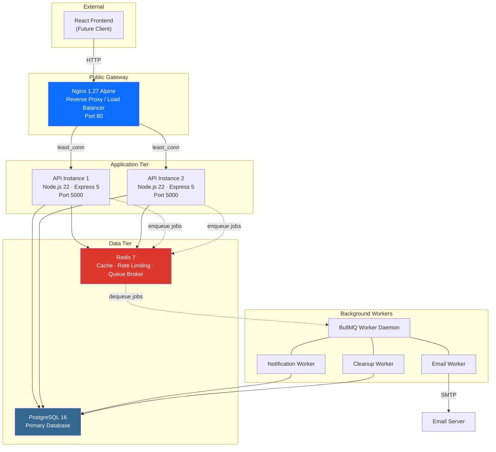

The system is a multi-container Docker Compose deployment. Nginx is the only public entry point. PostgreSQL and Redis have no exposed ports — they live on an internal bridge network (`expense_network`). The React frontend does not exist yet but represents the intended client.

---

## 2. Request Lifecycle

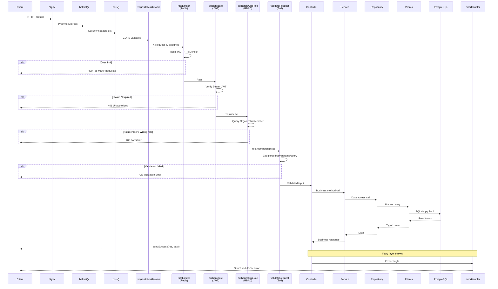

This is the exact middleware execution order defined in `app.ts`. Rate limiting uses Redis and runs before authentication to block brute-force attempts regardless of token validity.

---

## 3. Authentication Flow

```mermaid
graph TD
    subgraph Register
        R1["POST /api/v1/auth/register"] --> R2["Validate input (Zod)"]
        R2 --> R3["Check email uniqueness"]
        R3 --> R4["bcrypt.hash(password, 12)"]
        R4 --> R5["Generate UUID + Access Token + Refresh Token"]
        R5 --> R6["sha256(refreshToken) → tokenHash"]
        R6 --> R7["$transaction:<br/>Create User + Org + OrgMember(OWNER) + RefreshSession"]
        R7 --> R8["Set-Cookie: refreshToken (HttpOnly)"]
        R8 --> R9["201 Response: accessToken + user + org"]
    end

    subgraph Login
        L1["POST /api/v1/auth/login"] --> L2["Find user by email"]
        L2 --> L3["bcrypt.compare(password, hash)"]
        L3 --> L4["Generate new Access + Refresh tokens"]
        L4 --> L5["Create RefreshSession (tokenHash)"]
        L5 --> L6["Set-Cookie + 200 Response"]
    end

    subgraph Refresh
        F1["POST /api/v1/auth/refresh"] --> F2["Read cookie: refreshToken"]
        F2 --> F3["jwt.verify(token, JWT_REFRESH_SECRET)"]
        F3 --> F4["sha256(token) → find RefreshSession"]
        F4 --> F5{"Session revoked?"}
        F5 -->|Yes| F6["⚠ REVOKE ALL user sessions<br/>(Reuse Detection / RFC 6819)"]
        F6 --> F7["401 TOKEN_REVOKED"]
        F5 -->|No| F8{"Session expired?"}
        F8 -->|Yes| F9["401 TOKEN_EXPIRED"]
        F8 -->|No| F10["Generate new Access + Refresh tokens"]
        F10 --> F11["$transaction: revoke old + create new session"]
        F11 --> F12["New Set-Cookie + 200 Response"]
    end

    subgraph Logout
        O1["POST /api/v1/auth/logout"] --> O2["sha256(cookie) → tokenHash"]
        O2 --> O3["Set revokedAt = now()"]
        O3 --> O4["Clear-Cookie + 200 Response"]
    end

    style F6 fill:#e74c3c,color:#fff
    style F7 fill:#e74c3c,color:#fff
```

Token rotation is atomic via `prisma.$transaction`. Reuse detection (when a revoked token is replayed) revokes ALL sessions for that user, forcing re-authentication on every device.

---

## 4. Multi-Tenancy + RBAC

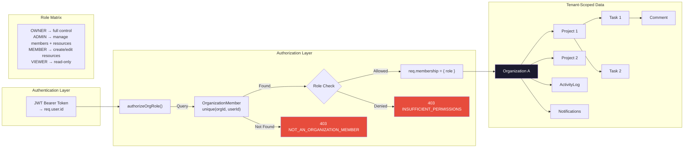

Every route under `/api/v1/organizations/:organizationId/...` enforces tenant isolation at the middleware level. The `organizationId` is extracted from `req.params` and checked against the `organization_members` table before any controller code executes. Every repository query also includes `WHERE organizationId = ...` as a secondary safeguard.

---

## 5. Database Relationship Diagram

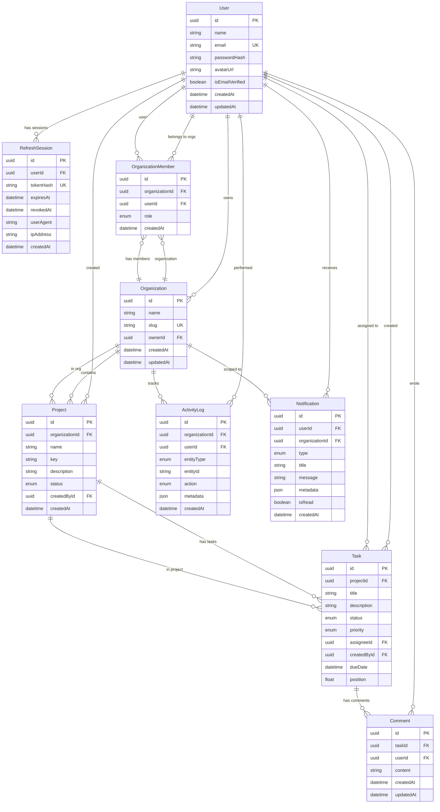

All IDs are UUIDs. Compound unique constraints: `(organizationId, userId)` on members, `(organizationId, key)` on projects. Cascade deletes flow from Organization → Members/Projects → Tasks → Comments.

---

## 6. Redis Cache Flow

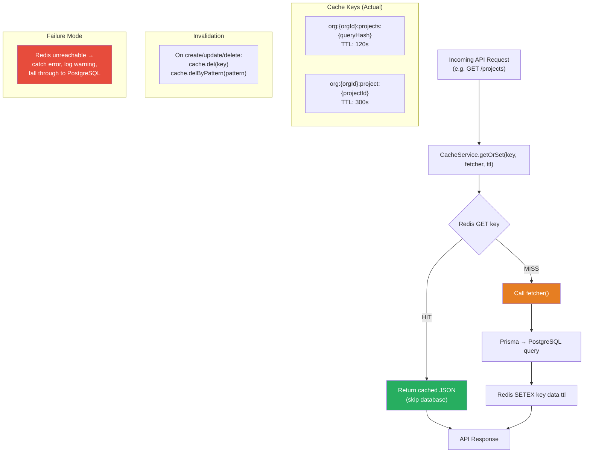

The caching layer is a resilient read-through cache. Every `get`/`set`/`del` method in `CacheService` wraps operations in try-catch blocks that log warnings and continue. If Redis is down, the app still works — just slower.

---

## 7. BullMQ Architecture

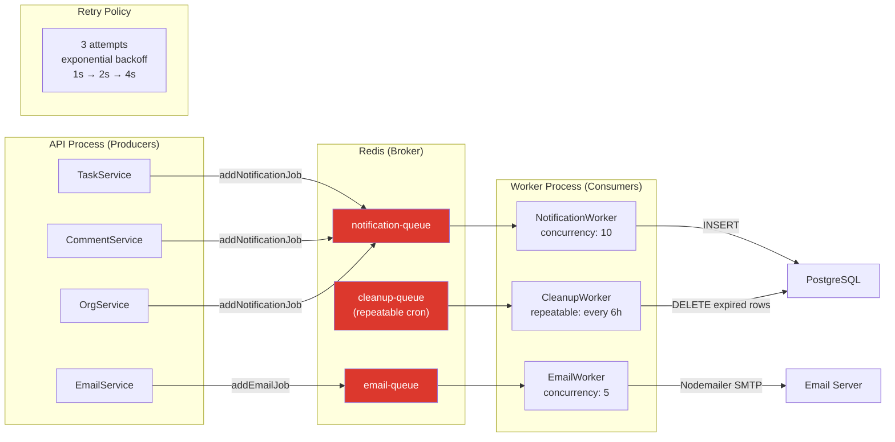

All three queues share the same Redis connection and retry configuration. Jobs are retained for debugging: completed for 24h (max 500), failed for 7 days (max 1000). The worker process is a standalone Docker container running the same image with a different CMD.

---

## 8. Email Flow

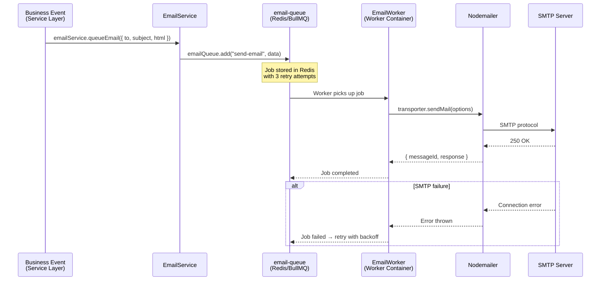

In test mode (`NODE_ENV=test`), Nodemailer uses `jsonTransport` which serializes emails to JSON instead of sending them, allowing tests to assert on email content without an SMTP server.

---

## 9. Notification Flow

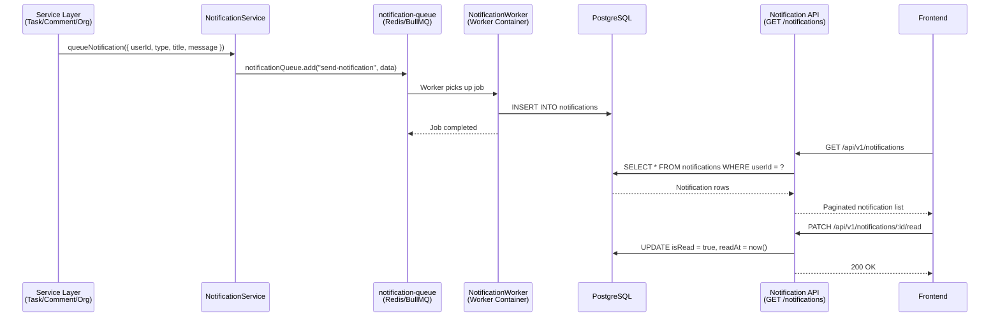

Notifications are created asynchronously via BullMQ — the HTTP response is never blocked by notification persistence. If the user or organization no longer exists (Prisma error P2003), the worker completes the job gracefully without retrying.

---

## 10. Nginx Load Balancing

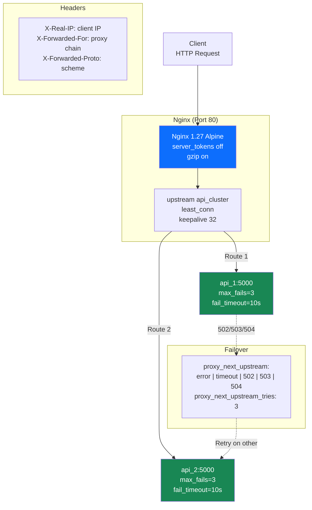

`least_conn` directs traffic to the instance with fewer active connections. `keepalive 32` maintains persistent upstream connections to avoid TCP handshake overhead. If an instance fails 3 times within 10 seconds, Nginx marks it unavailable and routes all traffic to the remaining instance.

---

## 11. Deployment Architecture

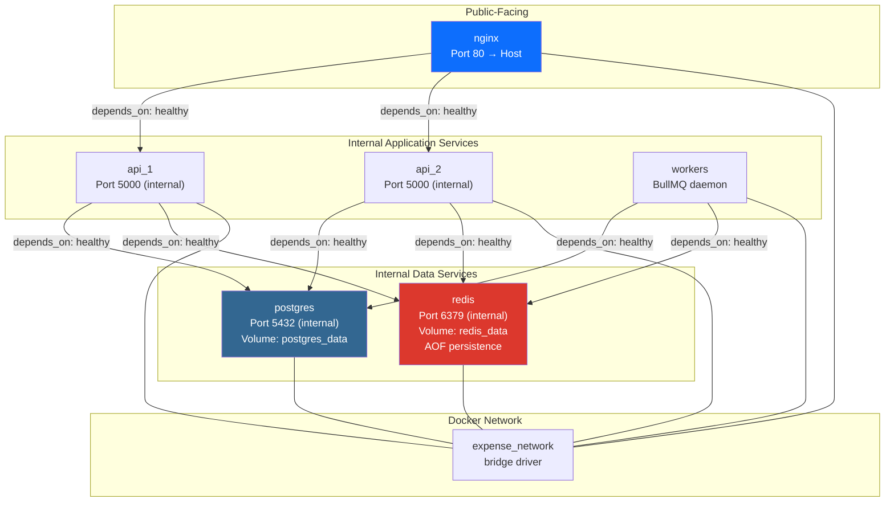

All services run on the same Docker bridge network. Only Nginx exposes a port to the host. PostgreSQL and Redis use named Docker volumes (`postgres_data`, `redis_data`) for persistence across restarts. Service startup is ordered via health checks: PostgreSQL/Redis → API instances → Nginx.

---

## 12. Task Creation Sequence

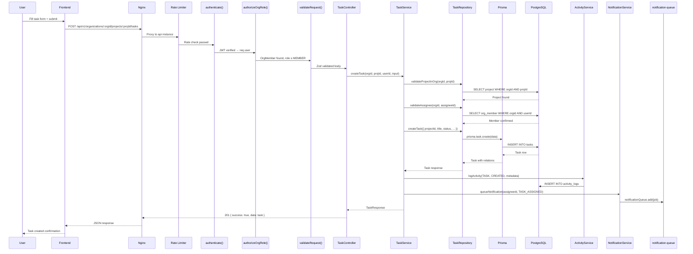

Notice the two validations before the actual insert: (1) the project must belong to this organization, and (2) the assignee must be a member of this organization. Activity logging is synchronous (same request), notification is asynchronous (via BullMQ queue).

---

## 13. Refresh Token Rotation Sequence

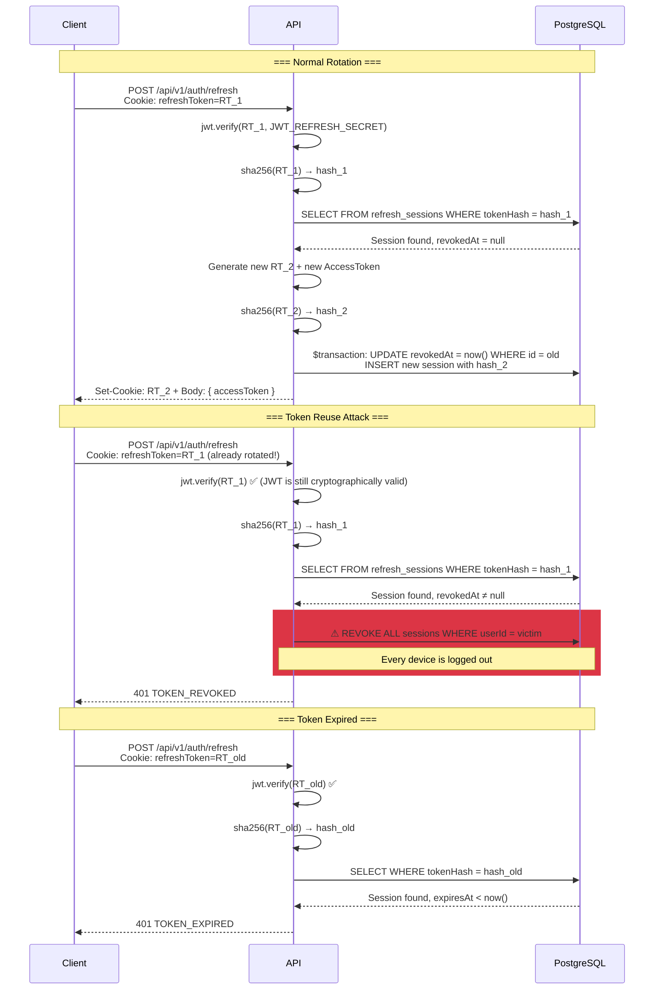

The red block shows the reuse detection mechanism (RFC 6819). If an attacker captures a rotated token and replays it, the system detects the revoked session and immediately invalidates ALL sessions for that user. The legitimate user is forced to re-authenticate, but the attacker's stolen tokens are all worthless.

---

## 14. CI/CD Architecture

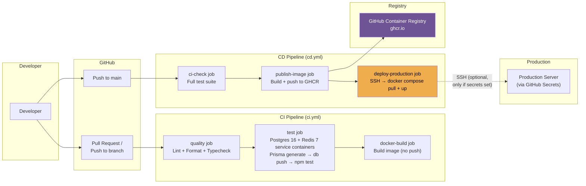

CI runs on every push/PR. CD runs only on pushes to `main`. The deployment step is conditional — it only executes if `DEPLOY_HOST`, `DEPLOY_USER`, and `DEPLOY_SSH_KEY` secrets are configured. Concurrency is controlled: CI cancels in-progress runs on the same branch, CD never cancels (to prevent partial deployments).

---

## 15. Load Testing Architecture

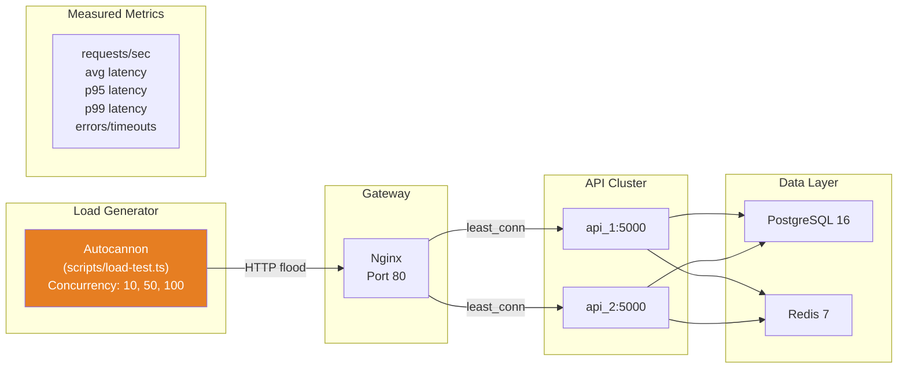

> **⚠ Important:** These benchmarks run against a **local Docker environment**. The numbers represent relative performance between endpoints and concurrency levels, NOT production capacity. Real-world throughput depends on network latency, instance sizing, database IOPS, and actual query complexity.

---

## 16. Security Architecture

```mermaid
graph TB
    subgraph "Layer 1: Network"
        NG["Nginx<br/>server_tokens off<br/>X-Frame-Options: DENY<br/>X-Content-Type-Options: nosniff<br/>X-XSS-Protection: 1; mode=block<br/>client_max_body_size: 10M"]
    end

    subgraph "Layer 2: Transport"
        HM["helmet()<br/>11 security headers<br/>Content-Security-Policy<br/>Strict-Transport-Security"]
        CR["cors()<br/>CORS_ORIGIN whitelist<br/>credentials: true"]
    end

    subgraph "Layer 3: Rate Limiting"
        GRL["General: 200 req / 60s per IP"]
        ARL["Auth: 20 req / 15min per IP+email"]
    end

    subgraph "Layer 4: Authentication"
        JWT["JWT Verification<br/>Access Token (15m expiry)<br/>Separate secrets for access/refresh"]
    end

    subgraph "Layer 5: Authorization"
        RBAC["RBAC via OrganizationMember<br/>4 roles: OWNER, ADMIN, MEMBER, VIEWER"]
        TI["Tenant Isolation<br/>WHERE organizationId = ?"]
    end

    subgraph "Layer 6: Input Validation"
        ZOD["Zod schema validation<br/>body + params + query"]
    end

    subgraph "Layer 7: Data"
        BC["bcrypt (12 rounds) password hashing"]
        TH["SHA-256 token hashing"]
        PC["Prisma parameterized queries<br/>(no raw SQL)"]
        CK["HttpOnly + Secure + SameSite cookies"]
    end

    subgraph "Layer 8: Error Safety"
        EH["errorHandler<br/>Production: generic error messages<br/>No stack traces leaked"]
    end

    NG --> HM --> CR --> GRL --> ARL --> JWT --> RBAC --> TI --> ZOD --> BC
    BC --> TH --> PC --> CK --> EH

    style NG fill:#0d6efd,color:#fff
    style RBAC fill:#198754,color:#fff
    style EH fill:#e74c3c,color:#fff
```

Security is enforced at every layer. An attacker must bypass Nginx headers, CORS, rate limiting, JWT authentication, RBAC authorization, Zod validation, AND Prisma parameterization to reach the database. Even then, passwords are bcrypt-hashed and tokens are SHA-256 hashed.

---

## 17. Future Google Integration

> **🔮 [FUTURE / NOT IMPLEMENTED]** — This diagram represents planned architecture, not existing code.

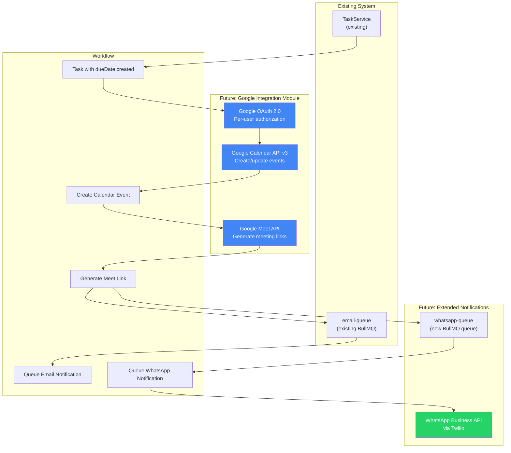

The integration would connect at the service layer — `TaskService.createTask()` and `TaskService.updateTask()` would conditionally trigger calendar/meet creation when tasks have a `dueDate`. WhatsApp notifications would use a new BullMQ queue to avoid blocking email delivery.

---

## 18. RAG Ingestion, Retrieval & Answer-Generation Architecture

> **✅ [IMPLEMENTED]** — Complete end-to-end RAG architecture:
> 1. **Ingestion**: Entity extraction (Project, Task, Comment, ActivityLog), sliding-window chunking, pluggable embedding providers (Gemini, OpenAI, Mock).
> 2. **Storage**: PostgreSQL dense vector storage (`rag_knowledge_documents`, `Float[] embeddings`).
> 3. **Retrieval**: Tenant-scoped vector similarity search (`POST /api/v1/organizations/:organizationId/rag/retrieve`) with cosine similarity and threshold filtering.
> 4. **Answer Generation**: Pluggable LLM provider (Groq LPU, Gemini, OpenAI, Mock), prompt injection defense, strict grounding without hallucinations, and source citations (`POST /api/v1/organizations/:organizationId/rag/query`).
>
> **🔮 [FUTURE / NOT IMPLEMENTED]** — Autonomous Agentic AI, tool calling, and workflow execution.

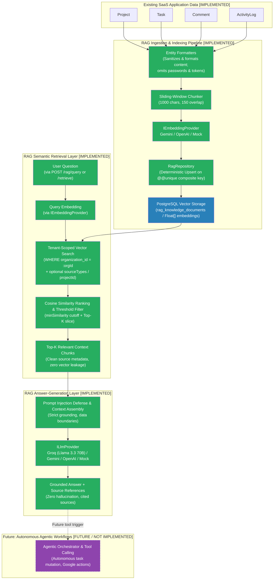

> **⚠ Security & Tenant Isolation Rule:** All RAG ingestion, retrieval, and answering operations are strictly scoped to `organizationId` at the database level. Passwords, password hashes, and access tokens are strictly stripped by entity formatters before chunking or embedding generation. Raw dense embedding arrays are never exposed via REST API responses. Context chunks are treated as untrusted data to neutralize prompt injection attacks.

---

## 19. Future Agentic Meeting Workflow

> **🔮 [FUTURE / NOT IMPLEMENTED]** — This diagram represents planned architecture, not existing code.

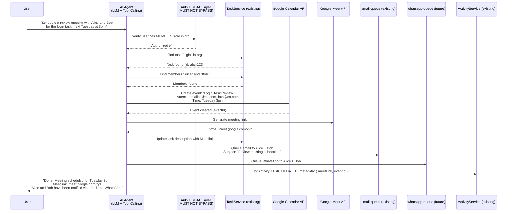

> **⚠ Critical security rule:** The AI agent must operate WITHIN the existing authentication and RBAC framework. It must:
> - Authenticate as the user who invoked it (not a system-level superuser)
> - Respect the user's role — a VIEWER cannot create tasks via the AI agent
> - Scope all data access to the user's organization
> - Never delete resources without explicit user confirmation
> - Log all actions to the activity log for auditability

---

## 20. Foundational AI Infrastructure & Read-Only Tools Layer

> **✅ [IMPLEMENTED]** — Core AI Infrastructure: Provider-independent LLM abstraction (`ILlmProvider` supporting Groq LPU, Gemini, OpenAI, Mock), AI Service (`AiService`), RAG context bridge (`RagService.retrieve`), execution limits (`AgentExecutionLimits`), prompt injection defense.
> **✅ [IMPLEMENTED]** — Safe Read-Only AI Tools Layer: `ToolRegistry`, `searchProjects`, `getProject`, `searchTasks`, `getTask`, `searchMembers`, `getMember`, `getRecentActivity`.
> **🔮 [FUTURE / NOT IMPLEMENTED]** — Write Tools (create/update/delete), Agent Orchestrator, Autonomous Tool Execution, and Multi-Step Agent Workflows.

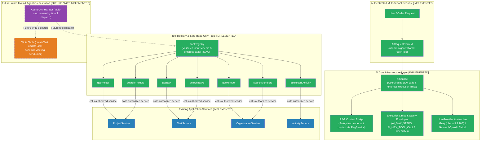

> **⚠ Security & Architecture Rule:** The AI layer never accesses Prisma or the database directly. All tool calls route through authorized application services respecting tenant isolation and caller permissions. Raw API keys, JWTs, and passwords are never passed to the LLM or exposed in tool outputs.

---

## How to Export These Diagrams

### Using Mermaid Live Editor (Recommended)

1. Open [mermaid.live](https://mermaid.live) in your browser.
2. Copy the content inside any ` ```mermaid ` code block from this document.
3. Paste it into the editor on the left side.
4. The diagram renders instantly on the right.
5. Click **Actions** → **PNG** or **SVG** to download.

### Using Mermaid CLI (Batch Export)

```bash
# Install Mermaid CLI globally
npm install -g @mermaid-js/mermaid-cli

# Export a single diagram to SVG
mmdc -i input.mmd -o output.svg

# Export to PNG with custom width
mmdc -i input.mmd -o output.png -w 1920
```

### Tips for Clean Exports

- **SVG** is preferred for documentation and presentations — it scales without losing quality.
- **PNG** at `1920px` width works well for LinkedIn, README embeds, and slide decks.
- For dark backgrounds, add `%%{init: {'theme': 'dark'}}%%` at the top of the Mermaid block.
- Sequence diagrams export best in portrait orientation; graph diagrams work better in landscape.
